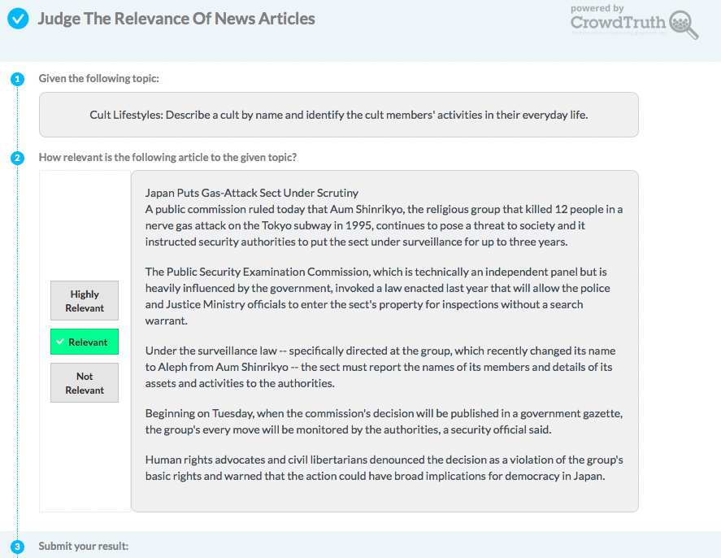
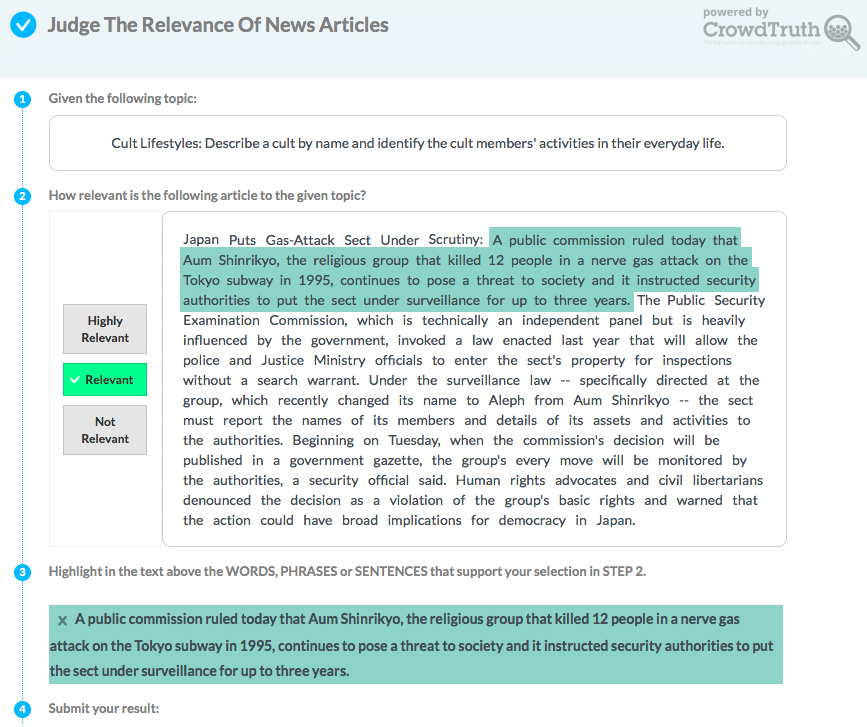
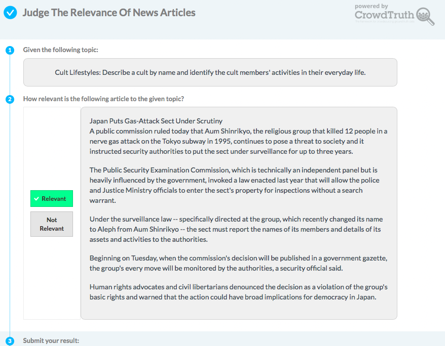
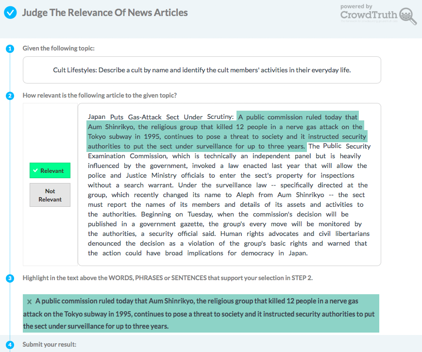
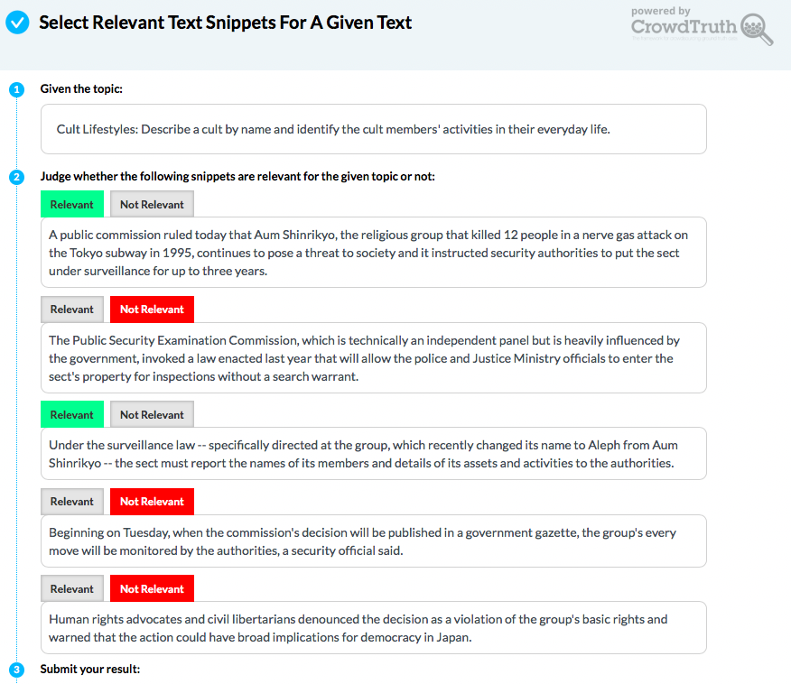
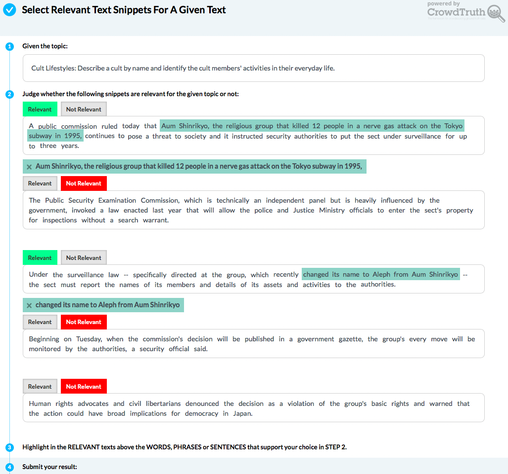
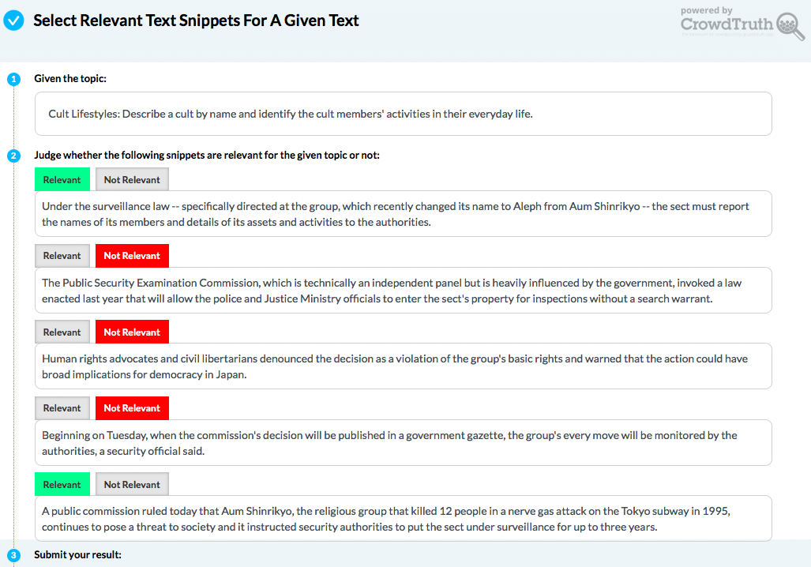
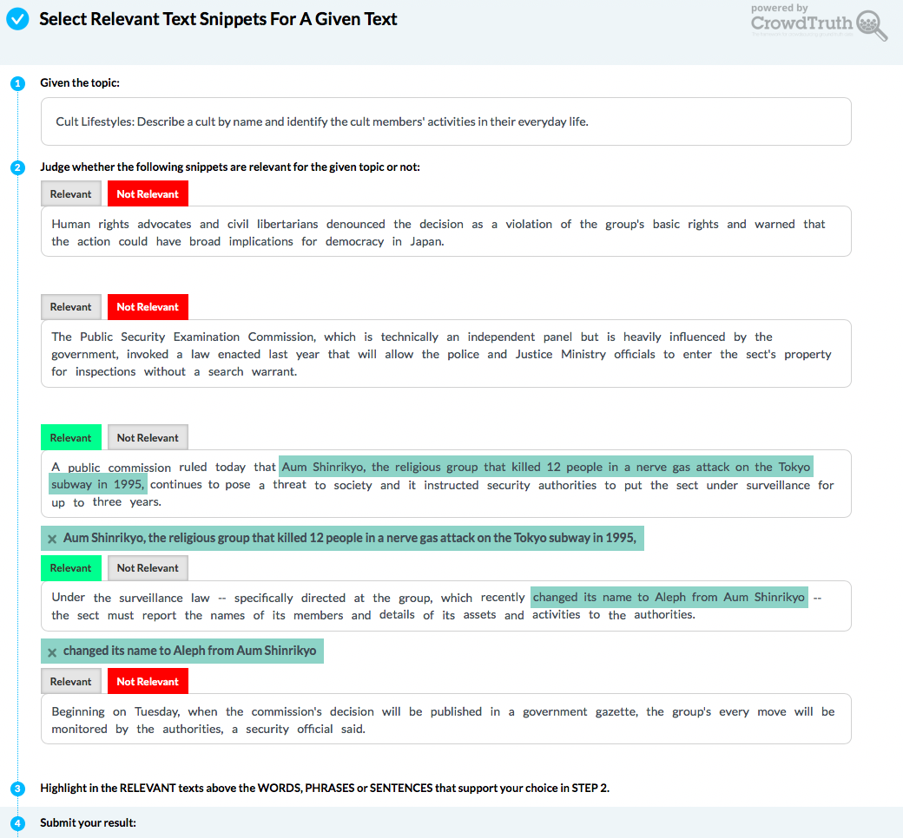

# NYTimes Corpus: Crowdsourcing Topical Relevance

This repository contains the crowdsourcing annotations for topical relevance referenced in the following paper:

* Oana Inel, Giannis Haralabopoulos, Dan Li, Christophe Van Gysel, Zoltán Szlávik, Elena Simperl, Evangelos Kanoulas and Lora Aroyo: **[Studying Topical Relevance with Evidence-based Crowdsourcing](https:...)**. [CIKM 2018](http://www.cikm2018.units.it).


If you find this data useful in your research, please consider citing:

```
@inproceedings{inel2018studying,
  title={Studying Topical Relevance with Evidence-based Crowdsourcing},
  author={Inel, Oana and Haralabopoulos, Giannis and Li, Dan and Van Gysel, Christophe and Szlávik, Zoltán and Simperl, Elena and Kanoulas, Evangelos and Aroyo, Lora},
  booktitle={To Appear in the Proceedings of the 27th ACM International Conference on Information and Knowledge Management (CIKM)},
  year={2018},
  organization={ACM}
}
```

## Crowdsourcing Templates
The following crowdsourcing templates have been used in the aforementioned article. We use the same experiment notation as in the article. To check each crowdsourcing annotation template, click on the small template icon. The image will open in a new tab.

| Type| Experiment | Template | Relevance Annotation Values | Document Granularity | Document Paragraph Order | Annotation |                
|:---:|:----------:|:--------:|:---------------------------:|:--------------------:|:------------------------:|:----------:|
| Pilot |   3P-Doc-NoHigh  |  | 3-point scale (Highly Relevant, Relevant, Not Relevant) |    Full  Document    |             -            |          Relevance Value         |
|Pilot|    3P-Doc-High   |  |  3-point scale (Highly Relevant,Relevant, Not Relevant) |    Full  Document    |             -            | Relevance Value + Text Highlight |
|Pilot|   2P-Doc-NoHigh |  |         2-point scale  (Relevant, Not Relevant)         |    Full  Document    |             -            |          Relevance Value         |
|Pilot|    2P-Doc-High  |  |         2-point scale  (Relevant, Not Relevant)         |    Full  Document    |             -            | Relevance Value + Text Highlight |
|Pilot| 2P-OrdPar-NoHigh |  |         2-point scale  (Relevant, Not Relevant)         |  Document Paragraphs |          Ordered         |          Relevance Value         |
|Pilot|  2P-OrdPar-High |  |         2-point scale  (Relevant, Not Relevant)         |  Document Paragraphs |          Ordered         | Relevance Value + Text Highlight |
|Pilot| 2P-RndPar-NoHigh |  |         2-point scale  (Relevant, Not Relevant)         |  Document Paragraphs |          Random          |          Relevance Value         |
|Pilot|  2P-RndPar-High |  |         2-point scale  (Relevant, Not Relevant)         |  Document Paragraphs |          Random          | Relevance Value + Text Highlight |
|  Main |  2P-RndPar-High |  |         2-point scale  (Relevant, Not Relevant)         |  Document Paragraphs |          Random          | Relevance Value + Text Highlight |
